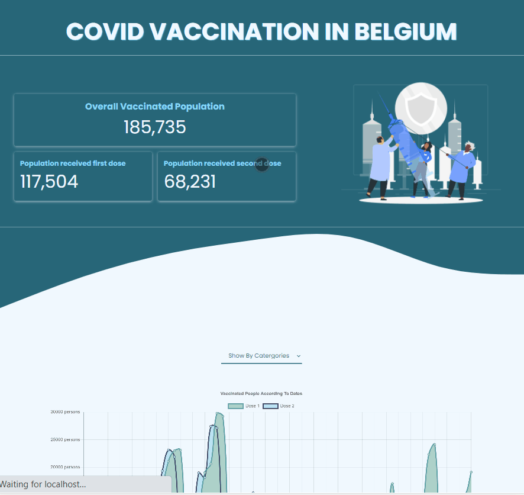

# COVID Vaccine Tracker of Belgium :syringe: :syringe:

Connected to the [Sciensano API]('https://epistat.wiv-isp.be/covid/') for the latest vaccination information in Belgium. Fetch the API and display the information through numbers and charts for visiualising the current vaccination progress. 

[Vaccine Tracker on Live]('')

 

---

## Objectives 
- Get familar to work with different API data, extract and calculate the information according to the needs. 
- Work in and to get used to React's structure.

 

---
### Tools
- React
- [Sciensano API]('https://epistat.wiv-isp.be/covid/')
- [react-chartjs-2]('https://github.com/reactchartjs/react-chartjs-2') for charts display
- [axios]('https://www.npmjs.com/package/axios') for fretching API
- [React CountUp]('https://www.npmjs.com/package/react-countup')
- [Wave background generator]('https://getwaves.io/') for the background svg
- [Illustration of Freepik Storyset]("https://storyset.com/people")
- VS Code
